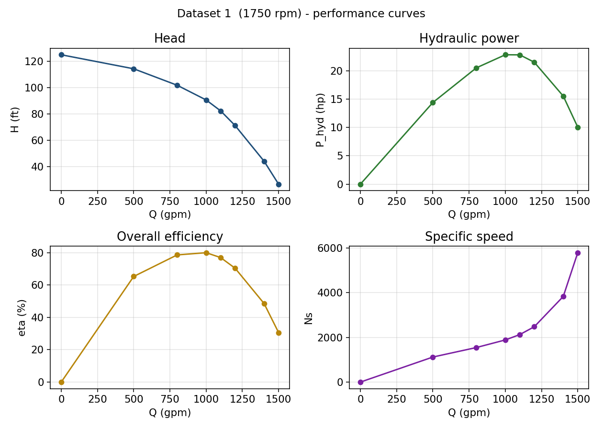
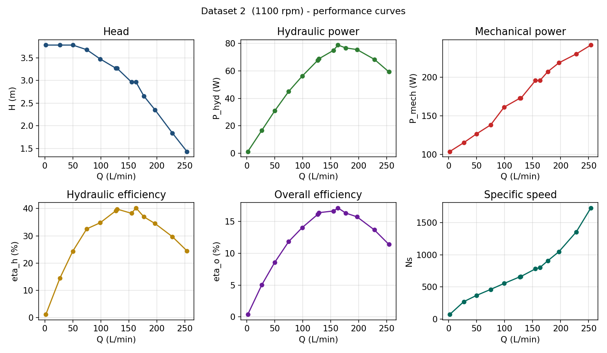
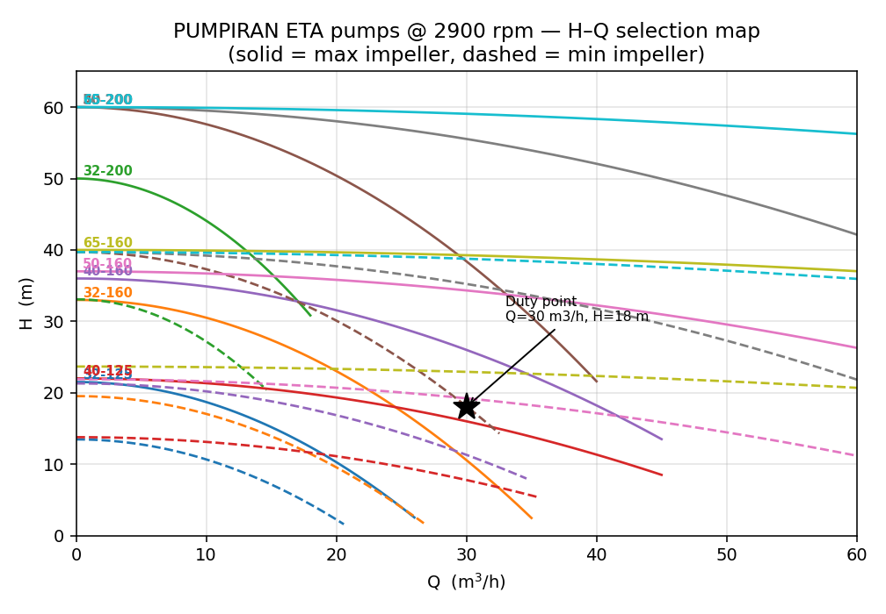

<div align="center">


# Analysis and Selection of a Centrifugal Pump

**Amirkabir University of Technology (Tehran Polytechnic)**
Faculty of Mechanical Engineering
Final Project — *Fluid Mechanics I*

**Author:** Amirhossein Ghayoumi · Student ID 40226409
**Instructor:** Dr. Alireza Mashayekh · **Teaching Assistant:** Mohammadi
Khordad 1405 (June 2026)

</div>

> **Note on this repository.** This is an English translation of the original
> Persian project report (`docs/original_report_persian.docx`). All figures,
> data and source code are the originals. The supporting files are:
> the assignment brief (`docs/assignment_fluid_mechanics_I.pdf`), the PUMPIRAN
> ETA pump catalog (`docs/PUMPIRAN_ETA_catalog.pdf` — a size-compressed copy of
> the original 41 MB catalog), the experimental datasets
> (`data/Pump_Analysis_Datasets.xlsx`) and the pump-selection program (`code/`).

---

## Introduction

Centrifugal pumps are among the most widely used fluid-transfer devices across
many branches of engineering. Understanding their operating principles and
performance characteristics plays a key role in the design and operation of
fluid-transport systems. In these pumps, a rotating impeller converts mechanical
energy into kinetic energy of the fluid; then, in the volute casing — whose
cross-sectional area increases gradually — part of that kinetic energy is
converted into pressure energy.

This report is organized in three main parts:

1. **Part 1** derives the governing equations and defines the pump performance
   parameters.
2. **Part 2** analyzes two sets of experimental data and obtains the performance
   curves.
3. **Part 3** presents a computer program that selects an appropriate pump from
   the PUMPIRAN catalog.

---

## Part 1 — Governing Equations and Performance Parameters

### 1-a) Control volume and conservation equations

Consider a control volume that encloses the entire pump, with section&nbsp;1 at
the inlet (suction) and section&nbsp;2 at the outlet (discharge). Three
conservation equations are written for this control volume.

**Conservation of mass.** For steady, incompressible flow the inlet and outlet
mass flow rates are equal, so the volumetric flow rate is also constant:

$$\dot m_1 = \dot m_2 \;\Rightarrow\; \rho Q_1 = \rho Q_2 \;\Rightarrow\; Q_1 = Q_2 = Q$$

**Energy equation (extended Bernoulli with pump head).** Writing the energy
equation between sections&nbsp;1 and&nbsp;2 and adding the head supplied by the
pump, $H_p$:

$$\left(\frac{p_1}{\rho g} + \frac{V_1^2}{2g} + z_1\right) + H_p = \left(\frac{p_2}{\rho g} + \frac{V_2^2}{2g} + z_2\right) + h_L$$

Neglecting the losses between the two gauge sections, the pump head is:

$$H_p = \frac{p_2 - p_1}{\rho g} + \frac{V_2^2 - V_1^2}{2g} + (z_2 - z_1)$$

**Conservation of angular momentum (Euler turbomachine equation).** Applying the
angular-momentum principle to the impeller, the torque exerted on the fluid and
the ideal Euler head are:

$$T = \rho Q\,(r_2 V_{t2} - r_1 V_{t1}) \qquad H_{\text{Euler}} = \frac{U_2 V_{t2} - U_1 V_{t1}}{g}$$

where $U = \omega r$ is the impeller peripheral speed and $V_t$ is the tangential
component of the absolute fluid velocity. This equation is the bridge between the
geometric and rotational characteristics of the impeller and the head produced by
the pump.

### 1-b) Definition of performance parameters

The following parameters are defined in terms of measurable pump quantities
(density, volumetric flow rate $Q$, torque $T$, and rotational speed $N$ or
$\omega$).

**Hydraulic power (useful water power)** — the power actually delivered to the
fluid; the product of specific weight, flow rate and head:

$$P_{\text{hyd}} = \rho g Q H = \gamma Q H$$

**Mechanical power (shaft power)** — the mechanical power delivered to the pump
shaft through torque and rotational speed:

$$P_{\text{mech}} = T \omega = T \cdot \frac{2\pi N}{60}$$

**Pump head** — the increase in mechanical energy per unit weight of fluid
between suction and discharge (for equal pipe diameter the velocity term drops
out):

$$H = \frac{p_2 - p_1}{\rho g} + \frac{V_2^2 - V_1^2}{2g} + (z_2 - z_1)$$

**Specific speed** — an index that classifies pumps and compares their geometry
independently of size:

$$N_s = \frac{N\sqrt{Q}}{H^{3/4}} \qquad\left(\text{dimensionless form: } \omega_s = \frac{\omega\sqrt{Q}}{(gH)^{3/4}}\right)$$

**Hydraulic efficiency** — the ratio of hydraulic power to shaft mechanical
power:

$$\eta_h = \frac{P_{\text{hyd}}}{P_{\text{mech}}} = \frac{\rho g Q H}{T \omega}$$

**Overall efficiency** — the ratio of hydraulic power to input (electrical/drive)
power; the overall efficiency is the product of the volumetric, hydraulic and
mechanical efficiencies:

$$\eta_o = \frac{P_{\text{hyd}}}{P_{\text{in}}} = \eta_{\text{vol}}\cdot\eta_h\cdot\eta_{\text{mech}}$$

---

## Part 2 — Analysis of Experimental Data

### Dataset 1 — 1750 rpm, water at 80 °F, 6 in pipe diameter

Because the suction and discharge pipe diameters are equal, the velocity-head
term cancels and the pump head is obtained from
$H = (p_d - p_s)\cdot 144/\gamma + \Delta z$ (with $\Delta z = 3$ ft). The shaft
input power is computed from the output of the three-phase motor:

$$P_{\text{in}} = \eta_{\text{motor}}\cdot\sqrt{3}\cdot(\text{PF})\cdot V \cdot I \qquad (\eta = 0.90,\; \text{PF} = 0.875,\; V = 460\text{ V})$$

**Values at Q = 800 gpm:** head $H = 101.7$ ft $= 31.0$ m; hydraulic power
$P_{\text{hyd}} = 20.5$ hp $= 15.3$ kW; overall efficiency $\eta_o = 78.6\%$.

#### Performance curves and polynomial fits — Dataset 1



***Figure 1.** Head, hydraulic power, efficiency and specific speed versus flow
rate (Dataset 1).*

**Analysis.** As the flow rate increases, the head decreases monotonically (the
typical falling characteristic of a centrifugal pump). The hydraulic power first
rises, reaches a maximum near $Q = 1000$ gpm, and then falls. The overall
efficiency curve also peaks near that point — the Best Efficiency Point (BEP) —
at about 80 %. The specific speed grows steadily with increasing flow. The fitted
polynomials are provided in the attached Excel workbook (sheet
`Polynomial_fits`).

| Q (gpm) | H (ft) | H (m) | P_hyd (hp) | P_in (kW) | Overall eff (%) | Ns |
|--------:|-------:|------:|-----------:|----------:|----------------:|-----:|
| 0    | 124.87 | 38.06 | 0.0   | 11.29 | 0.0  | 0    |
| 500  | 114.22 | 34.81 | 14.39 | 16.44 | 65.3 | 1120 |
| 800  | 101.72 | 31.00 | 20.51 | 19.45 | 78.6 | 1545 |
| 1000 | 90.54  | 27.60 | 22.82 | 21.27 | 80.0 | 1885 |
| 1100 | 82.26  | 25.07 | 22.80 | 22.09 | 77.0 | 2125 |
| 1200 | 71.10  | 21.67 | 21.50 | 22.78 | 70.4 | 2476 |
| 1400 | 44.02  | 13.42 | 15.53 | 23.84 | 48.6 | 3832 |
| 1500 | 26.59  | 8.10  | 10.05 | 24.47 | 30.6 | 5789 |

### Dataset 2 — 1100 rpm, water at 25 °C, 15 cm pipe diameter

Here the elevation difference is neglected and the motor power is reported
directly. The shaft mechanical power is computed from torque and rotational
speed: $P_{\text{mech}} = T\omega$ with $\omega = 2\pi N/60 = 115.2$ rad/s.

**Values at Q = 197 L/min:** head $H = 2.35$ m; hydraulic power
$P_{\text{hyd}} = 75.5$ W; hydraulic efficiency $\eta_h = 34.5\%$; overall
efficiency $\eta_o = 15.7\%$.

#### Performance curves and polynomial fits — Dataset 2



***Figure 2.** Head, hydraulic power, mechanical power, hydraulic/overall
efficiency and specific speed (Dataset 2).*

**Analysis.** The head trend is falling, as in the first dataset. The shaft
mechanical power increases steadily with flow rate, whereas the hydraulic power
has an intermediate peak. The maximum hydraulic efficiency is about 40 % and the
maximum overall efficiency about 17 %; the low overall efficiency is due to the
small size of this laboratory pump and the losses in its motor. The polynomial
fits are provided in the attached Excel file.

| Q (L/min) | H (m) | P_hyd (W) | P_mech (W) | Hydraulic eff (%) | Overall eff (%) |
|----------:|------:|----------:|-----------:|------------------:|----------------:|
| 2   | 3.78 | 1.2  | 103.7 | 1.2  | 0.4  |
| 27  | 3.78 | 16.6 | 115.2 | 14.5 | 5.0  |
| 50  | 3.78 | 30.8 | 126.7 | 24.3 | 8.6  |
| 75  | 3.68 | 45.0 | 138.2 | 32.6 | 11.8 |
| 99  | 3.48 | 56.1 | 161.3 | 34.8 | 14.0 |
| 127 | 3.27 | 67.7 | 172.8 | 39.2 | 16.1 |
| 129 | 3.27 | 68.8 | 172.8 | 39.8 | 16.4 |
| 155 | 2.97 | 74.9 | 195.8 | 38.3 | 16.6 |
| 163 | 2.97 | 78.8 | 195.8 | 40.2 | 17.1 |
| 177 | 2.66 | 76.7 | 207.3 | 37.0 | 16.3 |
| 197 | 2.35 | 75.5 | 218.9 | 34.5 | 15.7 |
| 228 | 1.84 | 68.4 | 230.4 | 29.7 | 13.7 |
| 254 | 1.43 | 59.3 | 241.9 | 24.5 | 11.4 |

---

## Part 3 — Pump Selection by Programming

The goal of this part is to write a program that, given the volumetric flow rate
$Q$ (m³/h) and the required head $H$ (m) from the user, suggests an appropriate
pump from the PUMPIRAN centrifugal-pump family (2900 rpm), together with the
impeller diameter, the efficiency at the operating point, and the required motor
power. Working range: flow rate below 40 m³/h and head below 40 m.

### Method and data extraction from the catalog

The head–flow curves (for the various impeller diameters), the efficiency
islands and the power curve for 10 pump models in the stated range were digitized
from the catalog charts (file `PUMPIRAN_ETA_catalog.pdf`, the 2900-rpm charts)
and stored as a data matrix in the program. For each model the characteristic
points (shut-off head, best-efficiency point, peak efficiency, and
maximum/minimum impeller diameters) were read, the head–flow curve was modeled by
$H(Q) = H_0 - a\,Q^2$, and the affinity law was used to model impeller trimming.
Efficiency is estimated by interpolation relative to the best-efficiency point.



***Figure 3.** Head–flow selection map of the ETA models at 2900 rpm (solid line:
maximum impeller, dashed line: minimum impeller).*

### Source code

The program is split into two modules (see the [`code/`](code) folder):

- [`pumpiran_catalog_2900.py`](code/pumpiran_catalog_2900.py) — the digitized
  catalog data (module of data).
- [`pump_selector.py`](code/pump_selector.py) — the pump-selection program.

The selection logic follows the catalog's own worked example: locate the model
whose H–Q field contains the duty point, trim the impeller so its curve passes
through $(Q, H)$, read the efficiency from the efficiency field, then size the
motor.

**Head–flow model (largest impeller):** $\;H(Q) = H_0 - a\,Q^2,\quad a = (H_0 - H_{\text{bep}})/Q_{\text{bep}}^2$
**Impeller trimming (affinity):** $\;D \to r = D/D_{\max} \Rightarrow H_r(Q) = r^2 H_0 - a\,Q^2$
**Efficiency model:** $\;\eta(Q) = \eta_{\max}\left(1 - \left(\dfrac{Q - Q_{\text{bep}}}{Q_{\text{bep}}}\right)^2\right) \ge 0$

Run it with:

```bash
python pump_selector.py            # runs the demo duty points
python pump_selector.py 20 25      # Q = 20 m3/h , H = 25 m
```

### Sample program output

For several sample duty points the program output is as follows:

```text
Duty point :  Q = 20 m3/h ,  H = 25 m   (2900 rpm)
  Recommended : ETA 40-160  |  impeller D = 153 mm  |  eff = 60.3 %  |  motor = 3.0 kW
  All feasible options:
    model     D(mm)   eta%   P_hyd  P_shaft   motor
    40-160      153   60.3    1.36     2.25     3.0
    50-160      142   46.4    1.36     2.93     4.0
    65-160      134   26.4    1.36     5.14     7.5

Duty point :  Q = 30 m3/h ,  H = 18 m   (2900 rpm)
  Recommended : ETA 40-160  |  impeller D = 149 mm  |  eff = 67.8 %  |  motor = 3.0 kW
  All feasible options:
    model     D(mm)   eta%   P_hyd  P_shaft   motor
    40-160      149   67.8    1.47     2.16     3.0
    40-200      170   54.7    1.47     2.68     4.0

Duty point :  Q = 12 m3/h ,  H = 30 m   (2900 rpm)
  Recommended : ETA 32-200  |  impeller D = 183 mm  |  eff = 44.7 %  |  motor = 3.0 kW
  All feasible options:
    model     D(mm)   eta%   P_hyd  P_shaft   motor
    32-200      183   44.7    0.98     2.19     3.0
    40-160      158   43.4    0.98     2.25     3.0
    50-160      153   30.3    0.98     3.23     4.0
    65-160      147   16.5    0.98     5.93     7.5

Duty point :  Q = 35 m3/h ,  H = 12 m   (2900 rpm)
  Recommended : ETA 40-125  |  impeller D = 133 mm  |  eff = 68.1 %  |  motor = 2.2 kW
  All feasible options:
    model     D(mm)   eta%   P_hyd  P_shaft   motor
    40-125      133   68.1    1.14     1.68     2.2
    40-160      143   65.9    1.14     1.73     2.2

Duty point :  Q = 25 m3/h ,  H = 20 m   (2900 rpm)
  Recommended : ETA 40-160  |  impeller D = 146 mm  |  eff = 65.9 %  |  motor = 3.0 kW
  All feasible options:
    model     D(mm)   eta%   P_hyd  P_shaft   motor
    40-160      146   65.9    1.36     2.06     3.0
    50-160      130   54.8    1.36     2.48     3.0
```

---

## Conclusion

In this project, the governing equations of the centrifugal pump were first
derived by defining a control volume, and the key performance parameters
(hydraulic and mechanical power, head, specific speed and the efficiencies) were
expressed in terms of measurable quantities. Two sets of experimental data were
then analyzed, their performance curves plotted and fitted with polynomials; the
maximum overall efficiency was about 80 % for the larger pump (Dataset 1) and
about 17 % for the small laboratory pump (Dataset 2). Finally, a program was
developed to select a pump from the PUMPIRAN catalog based on the digitized curve
data, recommending the pump model, impeller diameter, efficiency and motor power
for any desired operating point.

---

## References

1. F. M. White, *Fluid Mechanics*, 8th ed., McGraw-Hill.
2. B. R. Munson et al., *Fundamentals of Fluid Mechanics*, Wiley.
3. PUMPIRAN centrifugal-pump catalog (ETA series / EN 733 standard).
4. *Fluid Mechanics I* final-project brief — Dr. Alireza Mashayekh.
